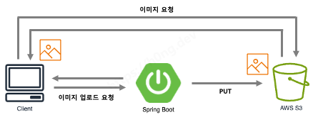
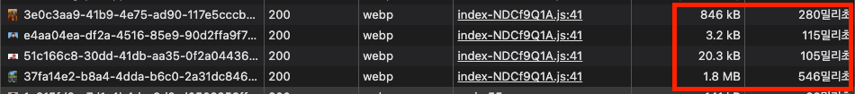
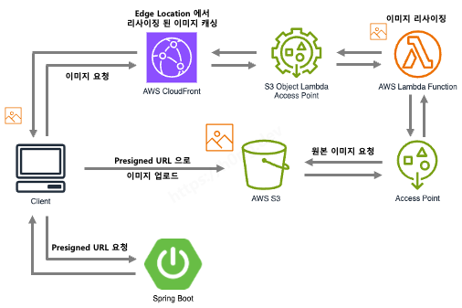
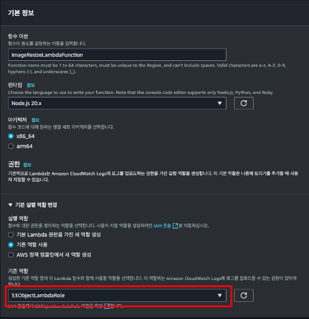
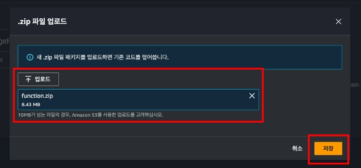
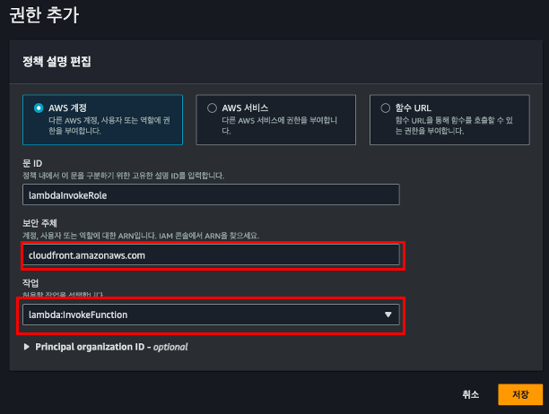
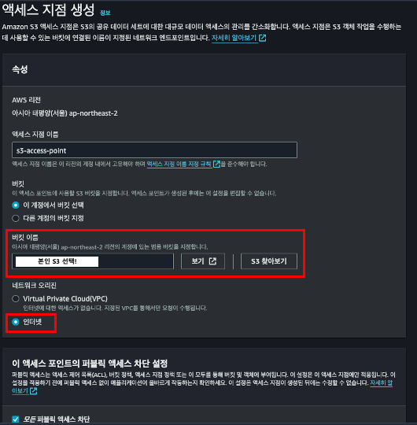
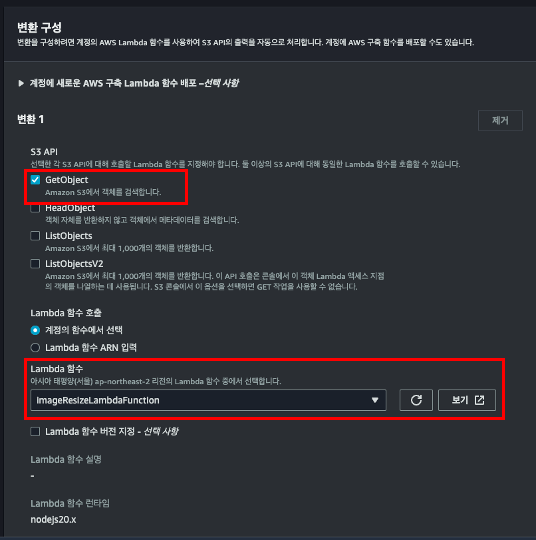
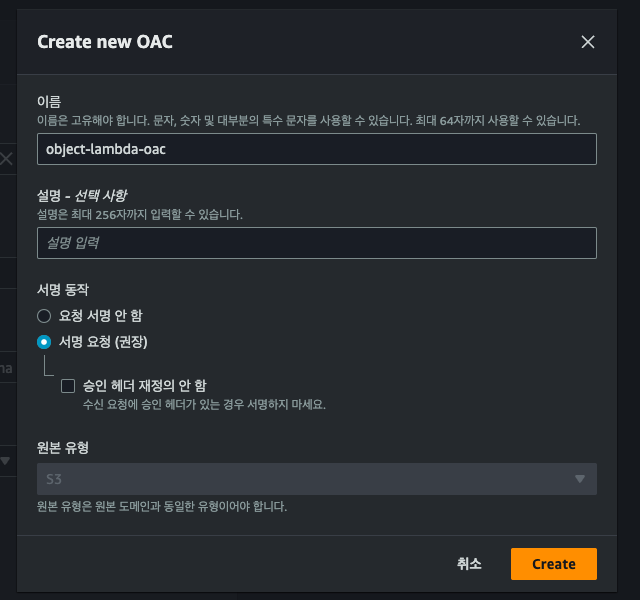

## 초기 이미지 로딩 아키텍처의 문제점

초기 DAO 프로젝트를 진행하면서 MVP 단계에서 빠른 구현에 초점을 맞추며, 아래 사진과 같이 이미지 시스템 아키텍처를 최대한 간단하게 가져갔다.



**이미지 로드 요청**

- 클라이언트가 S3 Object 엔드포인트로 직접 `GET` 요청
    <!-- 2. **이미지 업로드 요청** -->
       <!-- - 클라이언트가 애플리케이션 서버로 이미지를 보내, 애플리케이션 서버에서 S3 에 업로드를 진행 -->

<br>

초기 위와 같이 구성한 이유는 이미지 업로드 자체가 우리 서비스의 메인 기능이 아닌 부수적인 기능이라고 판단하여, `PUT`에 대한 최소한의 보안만 고려해 빠르게 구성하고 메인 기능에 좀 더 집중할 수 있도록 했다. 따라서, MVP 단계에서 느린 이미지 Upload 및 Load 속도를 제어하기 위해 업로드 가능한 사이즈를 `1MB` 제한을 주었다.

위 사진과 같이 구성한 이유는 이미지 업로드 자체가 우리 서비스의 메인 기능이 아닌 부수적인 기능이라 판단해 `PUT` 요청에 대한 최소한의 보안만 고려하여 구성하고 메인 기능에 집중하였다. 초기 최대 업로드 가능한 이미지 크기는 `1MB`로 제한함으로 써, 이미지 업로드 및 다운로드 속도를 제어하고 있었다. MVP의 메인 기능들이 완성되고, 휴대폰을 찍은 사진을 많이 올리는 SNS 서비스의 특성상 `1MB` 용량 제한을 `25MB` 으로 늘리도록 결정하였고, 이미지 용량 제한이 25배가 증가함에 따라 프론트엔드에서 이미지를 `.webp` 형식으로 변환하여 업로드하도록 로직을 수정함으로 써, 성능 이슈를 대비하였다.

아래의 `.webp` 로 변환하여 이미지를 업로드 했을 때의 이미지 로드 속도를 봐보자:



`1.8MB` 크기의 이미지를 완전히 불러오기까지 `500ms` 가 넘게 걸리고 있었다. 불러올 이미지의 크기가 `20MB`가 넘는다면 이미지를 완전히 불러오는 시간은 `1000ms` 을 가볍게 넘는 것은 물론, 네트워크 대역폭도 증가하게 된다. 따라서, 이미지를 완전히 불러오기까지 걸리는 최대 시간을 `200ms` 이내로 들어오도록 목표를 잡았게되었다.

## 이러한 문제점을 개선할 수 있을까?

결론부터 말하자면, 이미지 시스템 아키텍처를 아래와 같이 개선하면서 다음과 같은 성과를 얻을 수 있었다:




- **이미지 로드 요청**
  1. 로드 시간(Cache-Hit 기준) : `500ms` -> `10ms` (응답 시간 약, **50배 개선**)
  2. 이미지 크기 : `1.8MB` -> `15.8KB` (대역폭 약, **99.14% 절약**)
     <!-- - **이미지 업로드 요청** -->
       <!-- 1. 클라이언트에서 직접 S3로 업로드 함으로 써, 서버 리소스 절약 -->
       <!-- 2. S3 비용 절약 -->

DAO 서비스는 아래의 **2가지 과정**을 거쳐 전반적인 이미지 시스템 아키텍처 개선을 이뤘고, 하나씩 소개하려고 한다.

<br>

1. <a href="#CDN-도입을-통한-RTT-및-S3-비용-개선"><u>**CDN** 도입을 통한 **RTT 및 S3 비용 개선**</u></a>

2. <a href="#S3-Object-Lambda-를-통한-이미지-리사이징"><u>**S3 Object Lambda** 를 통한 **이미지 리사이징**</u></a>

<!-- 3. <a href="#Presigned-URL-도입으로-애플리케이션-리소스-절약"><u>**Presigned URL** 도입으로 애플리케이션 **리소스 절약**</u></a> -->

## **CDN** 도입을 통한 RTT 및 S3 비용 개선

<!-- > **RTT**(Round Trip Time)이란?
>
> 네트워크 요청을 시작한 후 응답을 받는 데까지 걸린 시간을 의미한다.
> 참고: [AWS - 네트워킹 RTT란 무엇인가요?](https://aws.amazon.com/ko/what-is/rtt-in-networking/) -->

초기 아키텍처에서 가장 개선이 필요한 부분은 <u>클라이언트가 AWS S3 로 직접 원본 이미지 요청</u>을 보내 발생하는 문제였다.

<!-- 가장 먼저 생각한 최적화 방법은 -->
<!-- **CDN** 즉, AWS CloudFront 을 도입하여 아래와 같은 이슈를 개선하려고 했다. -->
<!-- 첫번째로 -->

1. **S3 캐싱 기능의 부재 이슈**
   - S3 자체에서 캐싱 기능이 없어, 사용자들이 동일한 객체에 접근할 때 매번 S3 에서 직접 데이터를 읽어 보내줘야한다.
2. **S3 비용 증가 이슈**
   - AWS S3 를 사용하면서 객체에 직접적으로 `GET` 요청으로 처리하면, S3 에 대한 데이터 전송 요금이 부과된다.
   - 즉, 1번 이슈와 동일하게 사용자들이 같은 객체에 계속 접근한다면? -> 비용은 계속 카운팅

클라이언트가 S3 로 직접 요청을 보내는 경우, 위 2가지 문제가 가장 큰 걸림돌이였다.

### CDN(AWS CloudFront) 도입 고려

캐싱 기능의 부재와 S3 에서 발생할 수 있는 비용 증가 이슈는, AWS 에서 제공하는 CDN 서비스인 CloudFront 를 통해 개선을 진행할 수 있었다. 아래의 AWS 에서 알려주는 CloudFront 에 대한 설명을 봐보자.

> CloudFront는 엣지 로케이션이라고 하는 데이터 센터의 전 세계 네트워크를 통해 콘텐츠를 제공합니다.
> CloudFront를 통해 서비스하는 콘텐츠를 사용자가 요청하면 <u>지연 시간이 가장 낮은 엣지 로케이션</u>으로 요청이 라우팅되므로 <u>가능한 최고의 성능</u>으로 콘텐츠가 제공됩니다.
>
> <br>
>
> (출처: [Amazon CloudFront란 무엇입니까?](https://docs.aws.amazon.com/ko_kr/AmazonCloudFront/latest/DeveloperGuide/Introduction.html))

CloudFront는 정적 이미지를 사용자와 가장 가까운 Edge Location 에서 캐싱함으로 써, RTT(Round Trip Time) 시간을 줄일 수 있을 뿐더러, 클라이언트가 S3와 직접 통신하는 것이 아닌 CloudFront의 Edge Location과 통신하고, 결정적으로 CloudFront에서 S3로 요청하는 <u>데이터 송신 비용은 **무료**</u>이다.


<!-- 클라이언트가 S3로 직접적으로 통신하는 것이 아니라 Edge Location 과 통신하고, CloudFront 에서 S3로 요청하는 비용은 **무료**이므로
정적 컨텐츠의 사이즈가 적을때는 S3 만 운영하는 것과 CloudFront 와 함께 운영하는 것의 차이는 적지만
정적 컨텐츠의 사이즈가 커질 수록 비용을 더 절약할 수 있다. -->

정적 컨텐츠의 사이즈가 적을 때, S3만 운영하는 것과 CloudFront와 결합하여 운영하는 것의 비용 차이는 적지만, 정적 컨텐츠의 사이즈가 커질수록 운용 비용의 차이는 커진다. 또한, 클라이언트와 S3 사이에서 CloudFront가 `Proxy` 역할을 해줌으로 써, 보안적으로 이점을 챙길 수 있다.

(해당 내용의 비용 비교는 [이 블로그](https://incheol-jung.gitbook.io/docs/q-and-a/infra/cloudfront-s3)에서 더 자세히 찾아볼 수 있다.)

### S3와 CDN의 결합 전후 로드 시간 비교

CloudFront와 S3 결합하여 운영할 때의 로드 시간을 봐보자.


Cache Hit 기준 `1.8MB` 컨텐츠가 `500ms`에서 `250ms`으로 응답 시간이 2배 개선된 것을 볼 수 있다. 하지만, 아직까지도 목표한 `200ms`이내로 이미지 로딩이 완료되지 않고있다.

### S3 + CDN(AWS CloudFront)의 한계

정적 이미지를 서빙하기 위해 S3와 CloudFront를 결합한 아키텍처만으로도 좋은 아키텍처라고 생각한다. 하지만, CDN은 <u>RTT만 줄여줄 뿐 근본적으로 이미지의 크기를 줄여주지 않음</u>으로 매우 큰 개선은 어렵다.

따라서, 이미지 크기를 줄이기 위한 추가적인 아키텍처 구성이 필요하다.

## S3 Object Lambda 를 통한 이미지 리사이징

<!-- 정적 컨텐츠 서빙을 위해 S3 와 함께 CloudFront 를 같이 사용하는 것은 분명히 좋은 방법이고, 실제로 이미지 로딩 속도도 아래와 같이 개선되었다:

`1.8MB` 컨텐츠 기준
로드 시간(Cache-Hit) : `500ms` -> `250ms` (응답 시간 약, **2배 개선**)
초기 로딩 속도와 비교해서 확실히 개선되었지만, 아직도 `1MB`가 넘은 이미지는 목표 수치인 `200ms` 안으로 들어오지 않는 것을 볼 수 있다.
즉, 새로 마주한 이슈는 CDN 의 역할이 클라이언트와 가까이 있는 Edge Location 에서 정적 컨텐츠를 캐싱하고 있어 RTT(Round Trip Time)을 크게 줄여줄 수 있지만, <u>근본적으로 이미지의
사이즈 자체를 줄여주지는 않는다.</u> -->

이미지 리사이징을 위한 추가적인 아키텍처를 구성하기 전, 현재 우리의 서비스를 살펴보자.

### 이미지 리사이징이 옳은 방법일까?


현재, 우리 서비스는 미리보기 이미지에서 **150x150** 픽셀, 상세보기 탭에서 **500x700** 픽셀로 랜더링하고 있다. 즉, 이보다 더 큰 이미지일 경우 <u>불필요한 이미지 크기로 인해 페이지의 성능을 저하를 유발</u>한다. 따라서, 클라이언트가 이미지를 랜더링할 때 필요한 크기 즉, <u>동적으로 이미지를 리사이징함으로 써</u> 응답 시간 및 대역폭을 개선할 수 있다고 기대했다.

<!-- 우리 서비스는 미리보기 이미지에서는 가로 세로 **150 x 150px**
상세보기를 눌렀을 때, 가로 세로 **500 x 700px** 으로 보여주고 있다.

이미지를 보내줄 때, 원본 크기 그대로가 아닌 표기할 크기에 최적화된 이미지를 클라이언트에 전달한다면 사용자는 해당 이미지가 원본인지 아닌지 육안상 구별하기 힘들 것이라고 판단하였다.

또, 필요한 이미지 크기마다 리사이징 후 S3에 저장하는 것은 프론트엔드 측에서 UI 변화가 생길때마다 모든 이미지를 새로 리사이징 해야한다는 부수적인 문제가 발생할 수 있다고 판단하여 동적으로 리사이징하는 방법을
채택했다. -->

### 동적 이미지 리사이징을 위해 고려한 방법들

나는 [앞서 구축한 아키텍처](#cdn-도입을-통한-rtt-및-s3-비용-개선)와 동적 이미지 리사이징 서비스를 결합하기 위해 아래의 3가지 방안을 고려했다.

1. **EC2 혹은 ECS 기반의 이미지 처리 서버 구성**

2. **Lambda@Edge**

3. **S3 Object Lambda**

첫번째, 이미지 처리를 위해 별도의 서버를 운영하는 방법은 핵심 기능 외에 추가적인 <u>관리 포인트</u>가 늘어나고 <u>유휴 시간 동안 발생하는 비용을 절감</u>하기 위해 서버리스 환경 즉, **AWS Lambda**를 사용하는 방법으로 기울게 되었다. 또한, Edge Location에 리사이징된 이미지가 캐싱되어 있다면 Lambda가 동작하지 않아 추가적인 비용 절감 효과도 기대했다.

두번째, Lambda@Edge를 사용하여 이미지 리사이징을 구현할 때 전 세계 모든 Edge Location에 리사이징된 이미지를 캐싱하므로 글로벌 리전이 필요한 경우 매우 유용하게 작용할 수 있다.

<!-- 두번째, Lambda@Edge는 전 세계 모든 Edge Location에서 동작하지만 특정 Edge Location 을 지정할 수 없으며, S3 Object Lambda 에 비해 대략 **3배의 비용**이 발생한다. -->


하지만, Lambda@Edge는 Lambda Function에 비해 대략 **3배의 비용**이 발생하며, 우리 서비스는 글로벌 리전은 필요하지 않으므로 최종적으로 S3 Object Lambda를 사용하여 동적 이미지 리사이징 아키텍처를 구축하기로 결정했다.

<!-- 현재 우리 서비스는 글로벌 리전은 필요하지 않고, 서울 리전 한곳만 사용하고 있고, 동적 이미지 리사이징을 위해 S3 Object Lambda 을 채택하기로했다. -->

### S3 Object Lambda 을 통한 이미지 리사이징 적용

> 본 글에서 사용한 Lambda Function의 코드는 [깃허브 리포지토리](https://github.com/JiHongKim98/aws-s3-lambda-image-resizer)에서 확인할 수 있다.

이제, DAO 서비스에서 어떻게 S3 Object Lambda를 설정했는지 예제를 통해 소개하겠다.

#### IAM 정책 생성

먼저, Lambda 함수가 S3 Object Lambda Access Point를 통해 S3 버킷에 저장된 객체에 안전하게 접근하고, 이를 동적으로 처리한 후 클라이언트(CloudFront)에 반환할 수 있도록 필요한 권한을 부여 하기 위해 아래와 같이 IAM 역할을 생성해줘야한다.


위 사진과 같이 `AmazonS3ObjectLambdaExecutionRolePolicy` 권한을 준 `S3ObjectLambdaRole` 역할을 만들었다.

#### 이미지 리사이징 Lambda Function 생성

IAM 권한을 만들었다면, 이미지 리사이징 작업을 진행할 수 있도록 Lambda Function를 만들어주자. 생성할 Lambda Function에 앞서 만들어둔 역할을 부여해줘야한다.



<!-- 만약, 필자가 미리 만들어둔 [이미지 리사이징 코드](https://github.com/JiHongKim98/aws-s3-lambda-image-resizer)를 사용할 것이라면, `Node.js 20.x` 환경으로 람다 함수를 생성해주자. -->

Lambda Function의 실행 환경은 `Node.js 20.x`으로 설정해줘야한다. 이미지 리사이징에 대한 [예제 코드](https://github.com/JiHongKim98/aws-s3-lambda-image-resizer)는 CloudFront가 Client의 요청을 받을 때, <u>리사이징될 높이와 길이에 대한 정보를 쿼리 파라미터로 각각 `h`와 `w`로 받아 리사이징</u>이 수행되도록 하는 로직으로 작성되어있다.

<!-- 필자가 만든 Lambda Function 은 CloudFront 가 Client 요청을 받을 때, 리사이징 될 높이와 길이에 대한 정보를 쿼리 파라미터로 각각 `h` 와 `w` 로 받아 리사이징 하는 로직으로 작성하였다. -->

```bash
# 이미지를 200x200 으로 리사이징 하고 싶다면 아래와 같이 요청을 보내면 된다.
https://cdn.joytas.io/abcd-efgh?h=200&w=200
```

(예제 코드가 아닌, 직접 구현한 Lambda Function을 사용할 예정이라면 각자 환경에 맞는 버전으로 설정하면 된다.)



완성한 Lambda Function 코드와 실행 환경을 합께 압축하여 위 사진과 같이 `.zip` 파일로 올려 배포해주자. Lambda Function 코드 배포가 끝났다면, CloudFront가 생성한 Lambda Function을 호출할 수 있도록 리소스 기반 정책과 이미지 리사이징 작업 중 런타임 오류가 발생하지 않도록 할당된 메모리 및 임시스토리지를 늘려줘야한다.

먼저, 리소스 기반 정책 권한부터 설정해보자. 리소스 기반 정책 권한 설정은 "구성"의 "권한"탭에서 설정할 수 있다.

<!-- (리소스 기반 정책 권한은 구성 -> 권한 탭에 들어가서 설정할 수 있다.) -->

<!-- 완성한 코드를 올려주고 Lambda Function 을 배포해주자. -->




보안 주체와 작업을 위 사진과 동일하게 작성함으로 써, CloudFront 서비스에서 생성한 Lambda Function을 호출할 수 있다. 다음으로, Lambda Function의 기본 구성을 수정해보자. Lambda Function의 기본 구성의 메모리와 임시 스토리지는 각각 `128MB` 와 `512MB` 이며, 제한 시간은 3초로 되어있다.


나는 큰 이미지를 리사이징 할 때, 런타임 오류가 발생하지 않게 하기 위해 위 사진과 같이 메모리와 임시 스토리지를 모두 `1024MB`으로, 제한시간은 5초로 변경하여 설정해줬다.

#### S3 Access Point 설정

이미지 리사이징 작업을 진행하는 Lambda Function 설정을 완료했다면, 이제 CloudFront가 Lambda Function을 통해 S3 객체에 접근하여 이미지 리사이징 작업을 진행할 수 있도록 S3 Access Point를 지정해줘야한다. S3 Access Point를 지정해줄 때, 지정할 S3 버킷과 동일한 리전에서 진행해야 하는 것을 주의해야한다.

<!-- 이제, CloudFront 가 Lambda Function 을 통해 S3 객체에 접근하여 이미지 리사이징 작업을 진행할 수 있도록 S3 Access Point 를 설정해주자. -->

<!-- S3 Access Point 를 설정할 때, 연결할 버킷이 존재하는 리전과 동일한 곳에 생성해줘야하는 것을 주의하자. -->




<!-- S3 Access Point에 대한 정책은 아래와 같이 설정하여 S3 Object Lambda가 접근할 수 있게 해주자. -->

이제, 아래와 CloudFront에 대한 정책을 아래와 같이 같이 부여해주자.

```json
{
  "Version": "2012-10-17",
  "Statement": [
    {
      "Sid": "AllowCloudFrontAccessPoint",
      "Effect": "Allow",
      "Principal": {
        "Service": "cloudfront.amazonaws.com"
      },
      "Action": "s3:*",
      "Resource": [
        "{{ Access Point ARN 기입 }}",
        "{{ Access Point ARN 기입 }}/object/*"
      ],
      "Condition": {
        "ForAnyValue:StringEquals": {
          "aws:CalledVia": "s3-object-lambda.amazonaws.com"
        }
      }
    }
  ]
}
```

#### S3 Object Lambda Access Point 설정

<!-- 다음으로, CloudFront에서 Lambda Function을 트리거 하기 위해 Object Lambda Access Point 를 설정해주도록 하자 -->

다음으로, CloudFront에서 Lambda Function을 트리거 하여 이미지 리사이징 작업을 실행하도록 S3 Object Lambda Access Point를 설정해야한다. S3 콘솔에서 아래와 같이 Object Lambda Access Point를 생성해주자.


우리는 Lambda Function 이 S3 에 저장된 Origin Image를 요청해 이미지 리사이징을 진행한 후 Client 즉, CloudFront에게 전달해줘야 하므로 이미지 리사이징 Lambda Function과 연결해야 한다. 따라서, S3로 `GET` 요청 허용을 꼭 체크해주자.



생성한 Object Lambda Access Point에 대한 정책은 CloudFront를 만들고 난 후 다시 설정하도록 하겠다.


<!-- CloudFront 에서 원본 도메인으로 Object Lambda Access Point 로 설정해야 하므로 별칭만 복사하고 다음 단계로 넘어가자. -->

다만 CloudFront를 생성할 때, 원본 도메인을 Object Lambda Access Point로 지정하여 Lambda Function을 트리거해야 하므로, Alias만 복사하고 넘어가도록 하겠다.

#### CloudFront 생성

<!-- CloudFront 를 생성하기 전, 리사이징 된 크기에 대한 정보를 포함하여 Edge Location 에 캐싱 처리하기 위해, 아래와 같이 `w` 와 `h` 를 캐싱에 포함하는 정책을 생성해야한다. -->

이제 우리는 리사이징할 크기의 정보를 쿼리 파라미터에 포함하여 Edge Location에 캐싱 처리를 진행해야한다. 따라서, 아래와 같이 길이와 높이에 대한 정보를 `w`와 `h`으로 캐싱하도록 새로운 정책을 생성해주자.


쿼리 파라미터를 포함한 정책을 생성했다면, 이전 단계에서 생성한 Object Lambda Access Point의 별칭을 원본 도메인 이름으로 설정해준다.


원본 도메인의 형식은 아래와 같다.

```bash
# 아래와 같은 형식으로 지정하면 된다.
{{ 별칭 }}.s3.{{ 리전 }}.amazonaws.com

# Example
object-lambda-access-7t5engtgxwiiyabj4w6utkygapn2a--ol-s3.s3.ap-northeast-2.amazonaws.com
```

또한, Object Lambda Access Point는 `public`하게 설정할 수 없기 때문에, OAC를 통해 원본에 대한 요청을 인증할 수 있도록 해줘야한다. 따라서, 아래와 같이 OAC를 생성하고 Origin Access Control로 설정해주자.

<!--  -->

<!--  -->




마지막으로, 앞서 생성한 쿼리 파라미터 기반의 캐싱 정책을 기본 정책으로 선택하여 생성해주면 CloudFront 설정을 마무리할 수 있다.

<!-- 기반으로 이미지를 동적으로 리사이징된 이미지를 Edge Location 에서 가지고 있도록 하기 위해, 위에서 만든 정책을 선택하여 생성해주면 된다. -->

<!--  -->


CloudFront의 대체 도메인 설정은 생략하도록 하겠다.

#### S3 Object Lambda Access Point 및 S3 Bucket 정책 부여

이제, CloudFront가 Object Lambda Access Point을 원본 요청으로 사용할 수 있도록 Object Lambda Access Point 및 S3 Bucket 정책을 각각 업데이트 해주자. 각 정책들은 아래와 같이 설정한다.

```json
# Object Lambda Access Point의 정책

{
  "Version": "2012-10-17",
  "Statement": [
    {
      "Effect": "Allow",
      "Principal": {
        "Service": "cloudfront.amazonaws.com"
      },
      "Action": "s3-object-lambda:Get*",
      "Resource": "{{ Object Lambda Access Point ARN 기입 }}",
      "Condition": {
        "StringEquals": {
          "aws:SourceArn": "{{ CloudFront ARN 기입 }}"
        }
      }
    }
  ]
}
```

아래의 S3 Bucket에 대한 정책에서 사용자 ARN은 현재 작업 중인 계정의 IAM 사용자 또는 역할 ARN을 넣어줘야한다.

```json
# S3 Bucket 정책

{
  "Version": "2012-10-17",
  "Id": "Policy1234567890",
  "Statement": [
    {
      "Sid": "S3ObjectAccessPoint",
      "Effect": "Allow",
      "Principal": {
        "AWS": "*"
      },
      "Action": "*",
      "Resource": ["{{ S3 Bucket ARN 기입 }}", "{{ S3 Bucket ARN 기입 }}/*"],
      "Condition": {
        "StringEquals": {
          "s3:DataAccessPointAccount": "{{ 사용자 ARN 기입 }}"
        }
      }
    }
  ]
}
```


이로써, S3 Object Lambda 아키텍처를 성공적으로 구성할 수 있다.

## 마무리 하며

나는 이미지 로딩 최적화 부분은 항상 프론트엔드에서의 영역이라고만 생각했고, 보안적으로 큰 문제가 생기는 것이 아니라면 큰 관심을 가지지 않았다. 그러나 SNS 서비스인 DAO를 운영하면서 이러한 관점이 얼마나 부정적인 영향를 미칠 수 있는지 깨닫게 되었다. 또한 백엔드 개발자로써, 서버리스에 대해 부정적인 인식을 가지고 비용을 고려하지 않는 채로 직접 애플리케이션을 구축하는 데만 집중해왔다. 이번 기회를 통해 서버리스를 무조건 배제하기보다는, 서비스 특성에 맞는 기술을 신중하게 채탱하는 것이 중요하다는 점을 다시금 깨닫은 기회였다.

---

## Ref.

https://incheol-jung.gitbook.io/docs/q-and-a/infra/cloudfront-s3<br>
https://aws.amazon.com/ko/blogs/korea/new-use-amazon-s3-object-lambda-with-amazon-cloudfront-to-tailor-content-for-end-users/<br>
https://medium.com/musinsa-tech/s3-object-lambda를-이용한-on-demand-이미지-변환-서비스-소개-5e3650cc27a9<br>
